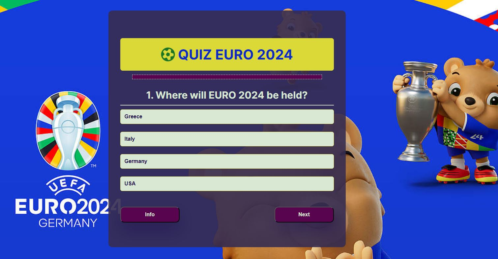
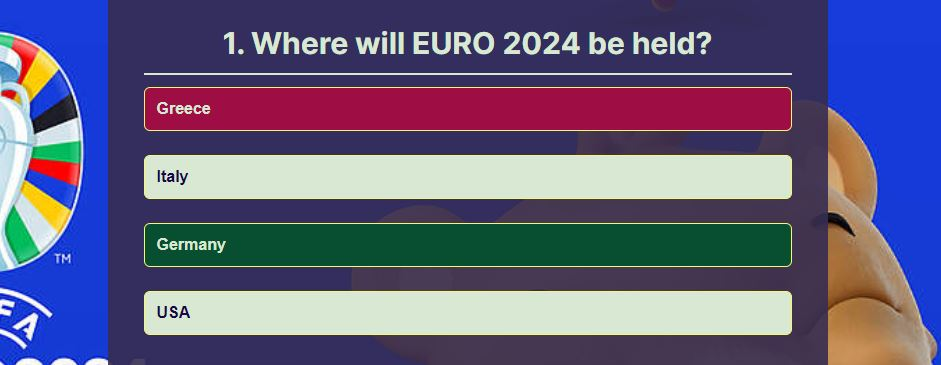
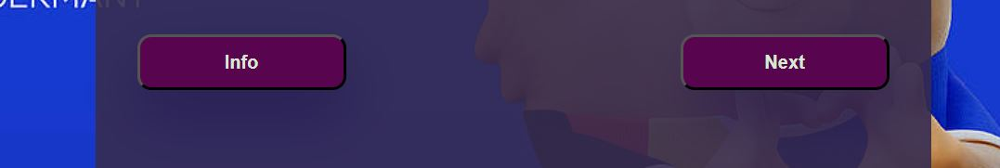
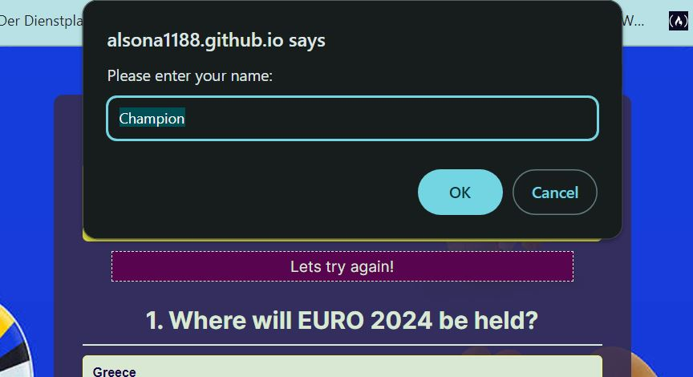
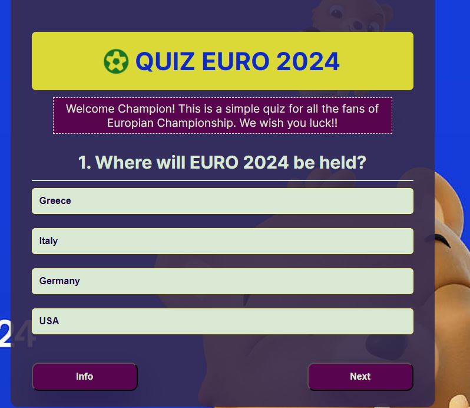
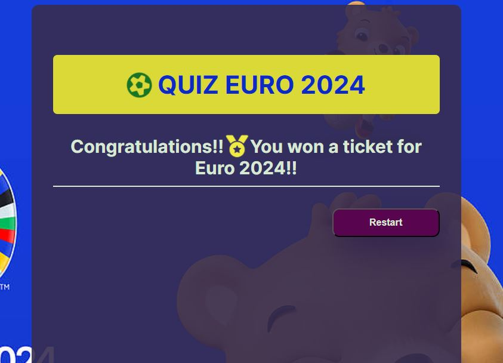
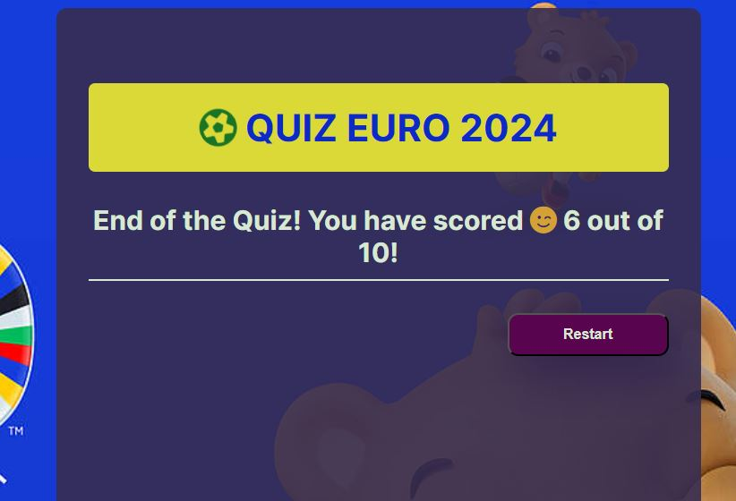
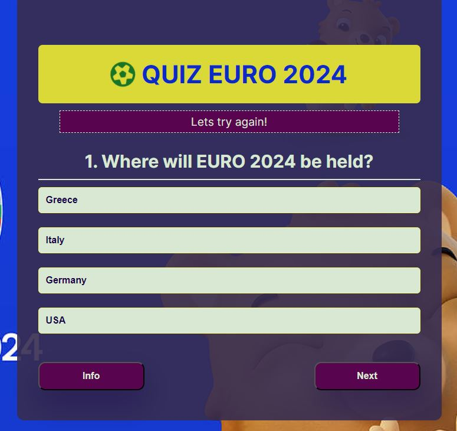

# **QUIZ EURO 2024**

## Project Overview

Quiz Euro 2024 is a small quiz game for all football and Euro Championship fans. It is a simple and fun quiz for all adults and children who want to test their knowledge but at the same time can learn new and interesting information.

I took the insipiration for this idea from the competition that will be held this year in Germany. Many people are looking forward to this compatition and through this quiz they can get more involved in the beautiful atmosphere that football and sport in general give people. 

### Live Website

You can visit the website [Quiz Euro 2024](https://alsona1188.github.io/euro2024-quiz/)

### My GitHub Repository

You can visit the GitHub Repository [here](https://github.com/alsona1188/euro2024-quiz)

## CONTENTS

- [**QUIZ EURO 2024**](#quiz-euro-2024)
  - [Project Overview](#project-overview)
    - [Live Website](#live-website)
    - [My GitHub Repository](#my-github-repository)
  - [CONTENTS](#contents)
    - [Common Usage](#common-usage)
  - [User Stories](#user-stories)
  - [Design](#design)
    - [Colour scheme](#colour-scheme)
    - [Typography](#typography)
  - [Features](#features)
    - [General Features on each page](#general-features-on-each-page)
    - [Future Implementations](#future-implementations)
   
### Common Usage

- Quiz Euro 2024 is an online quiz aimed to test the knowledge of all the fans of Eurpian Championship.
- Quiz contestants could enjoy this type of a quiz at a gathering with friends and family to give their evening a fun and competitive element.
- This quiz will also inform about some interesting information to all the people that will participate on it. 
- In case the user find all the questions, he will win a ticket to a random match in the Europian Championship.

## User Stories

- I want to put my knowledge to the test in this particular topic.
- I want to be able to easily navigate through the page and understand clearly its different functions and information presented to me.
- I want it to be dynamic and fun so I can enjoy myself either alone or in the company of my friends whilst going through the quiz.

## Design

### Colour scheme

I designed the colour palette for the website myself. I only used [colorspace](https://mycolor.space/?hex=%23100B18&sub=1).

### Typography

I used Google Fonts to import the following:

- 'Inter', is a sans-serif style which I chose. It looks aimple and clear at the same time.
  
 ## Features

### General Features on each page

The page is responsive and contains:

- Favicon of the Website, chosen to match the theme of the site.

- Landing Page
  - This would be the first page the user would see, introducing the theme with an heading and an icon, background image. There are two buttons that the user sees at the first sight.
- 

- Quiz Area
  - Here users can see directly the quiz. The quiz area has the main question and also 4 option for each question.
  - Once the user selects an answer, different colours are displayed to show if they were correct.  The user is also given a 'next' button which allows the user to go onto the next question.

- Info and Next buttons
 - The user can see directly two buttons.
  

 - If the user clicks the info button, a pop up information will come up that will ask the user to add the username.
  
  
  
 - After entering the name an automatic message will display in the quiz area. This message will give a little information about the game.
  

- If no name is entered, so if the user closses with x, it will show the message "no name was entered".
  
  

- Result Page
  - In the last page will be 2 different message displayed.
  - The next button will be converted to restart button.
  - A sound effect is added on the last page, which indicates that the game is over.
  - The first case is when the user finds all the questions.
  

  - The second case is when the user will not find all the correct answers.
  
  

  - After clicking the restart button, the info button will apear again and the message will change to "Let's try again"
  
 

- Sound Effects
  - The first sound is implemented when the user presses the info button. This helps give the user a sense of immersion into the game.
  - The correct & incorrect sound effects are activated upon selecting an answer, helping to add excitement to the user's experience.

### Future Implementations

