# **QUIZ EURO 2024**

## Project Overview

Introducing Quiz Euro 2024 - a dynamic quiz game designed to ignite the passion of football fans and immerse them in the excitement of the upcoming Euro Championship. Inspired by the anticipation surrounding the tournament in Germany, this interactive quiz is your ticket to a world of fun and knowledge about one of the most celebrated events in football.

Quiz Euro 2024 isn't just another trivia game; it's an immersive experience crafted for fans of all ages, whether you're a seasoned football aficionado or just starting to explore the world of soccer. Dive into a treasure trove of questions spanning the history of the Euro Championship, unforgettable moments, host cities, and fascinating trivia that will leave you amazed.

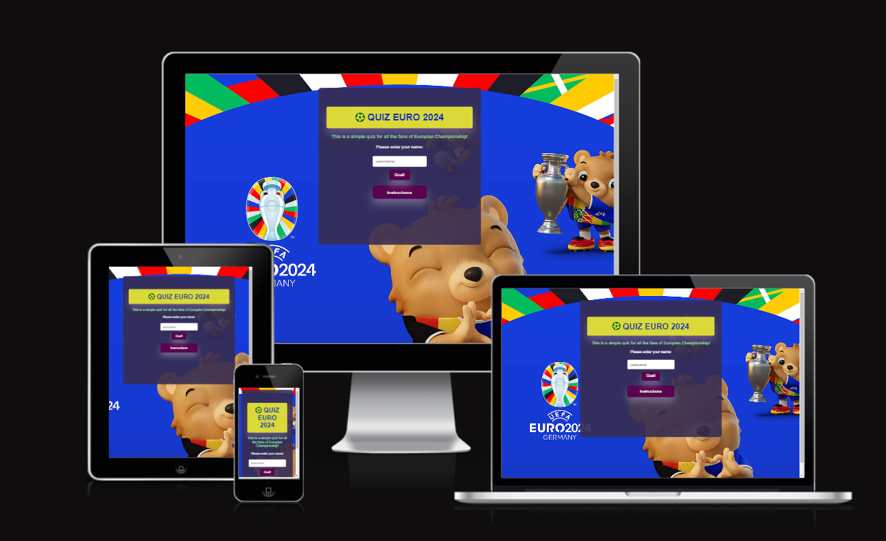

### Live Website

You can visit the website [Quiz Euro 2024](https://alsona1188.github.io/euro2024-quiz/)

### My GitHub Repository

You can visit the GitHub Repository [here](https://github.com/alsona1188/euro2024-quiz)

## CONTENTS

- [**QUIZ EURO 2024**](#quiz-euro-2024)
  - [Project Overview](#project-overview)
    - [Live Website](#live-website)
    - [My GitHub Repository](#my-github-repository)
  - [CONTENTS](#contents)
    - [Common Usage](#common-usage)
  - [User Stories](#user-stories)
  - [Design](#design)
    - [Colour scheme](#colour-scheme)
    - [Typography](#typography)
  - [Features](#features)
    - [General Features on each page](#general-features-on-each-page)
    - [Future Implementations](#future-implementations)
  - [Testing](#testing)
    - [Validator Testing](#validator-testing)
    - [Lighthouse](#lighthouse)
    - [Bugs](#bugs)
  - [Technologies Used](#technologies-used)
  - [Deployment And Local Development](#deployment-and-local-development)
    - [Deployment to GitHub pages](#deployment-to-github-pages)
    - [Local Deployment](#local-deployment)
      - [How to Fork](#how-to-fork)
      - [How to Clone](#how-to-clone)
   
### Common Usage

- Quiz Euro 2024 is an online quiz aimed to test the knowledge of all the fans of Eurpian Championship.
- Quiz contestants could enjoy this type of a quiz at a gathering with friends and family to give their evening a fun and competitive element.
- This quiz will also inform about some interesting information to all the people that will participate on it. 
- In case the user find all the questions, he will win a ticket to a random match in the Europian Championship.

## User Stories

- I want to put my knowledge to the test in this particular topic.
- I want to be able to easily navigate through the page and understand clearly its different functions and information presented to me.
- I want it to be dynamic and fun so I can enjoy myself either alone or in the company of my friends whilst going through the quiz.

## Design

### Colour scheme

I designed the colour palette for the website myself. I only used [colorspace](https://mycolor.space/?hex=%23100B18&sub=1).

### Typography

I used Google Fonts to import the following:

- 'Inter', is a sans-serif style which I chose. It looks simple and clear at the same time.
  
 ## Features

### General Features on each page

The page is responsive and contains:

- Favicon of the Website, chosen to match the theme of the site.

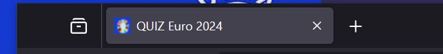

- Landing Page
  - This would be the first page the user would see, introducing the theme with an heading and an icon, background image.
  - The user has to create a username and submit. If not an alert message will come. 
  - Instructions button, here the user can read how to play. 
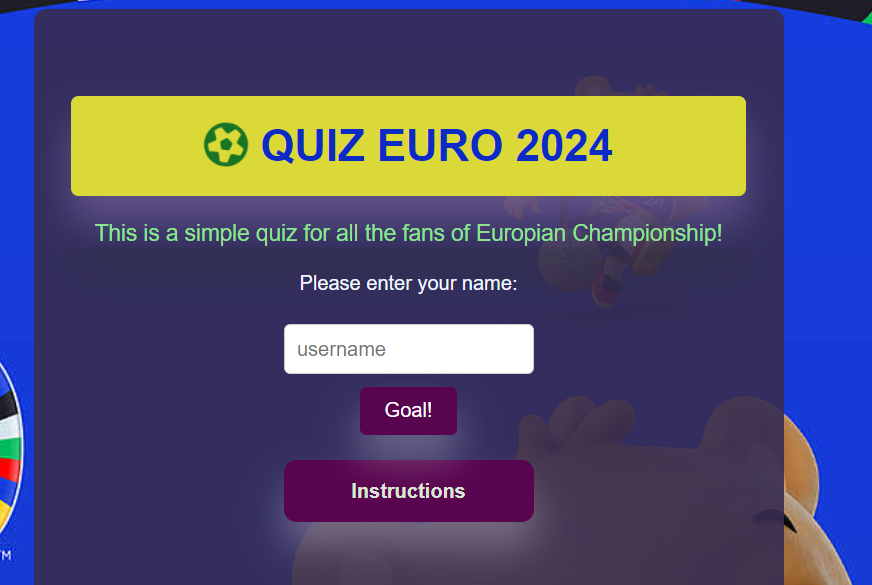

- Welcome message
  - After submiting the username the user will see a welcome message and also the start button.

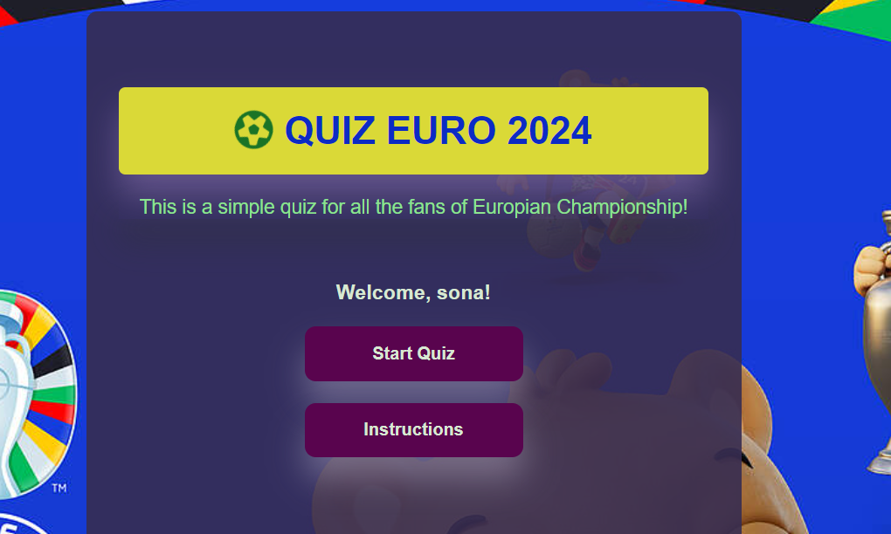

- Quiz Area
  - Here users can see directly the quiz. The quiz area has the main question and also 4 option for each question.
  - Once the user selects an answer, different colours are displayed to show if they were correct.  The user is also given a 'next' button which allows the user to go onto the next question.
  - The user will see that there is a time limit of 15 seconds for each question.

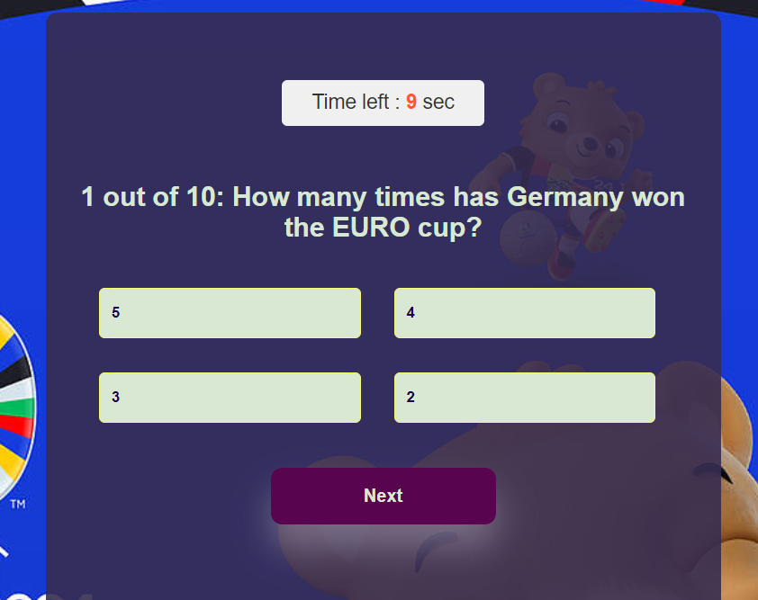

  - When the time is over an alert will show that the game will restart again.

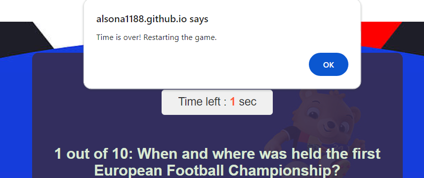

- Result Page
  - Here the user will see a scoreboard with username, the total scores, total correct answers and total wrong answers.

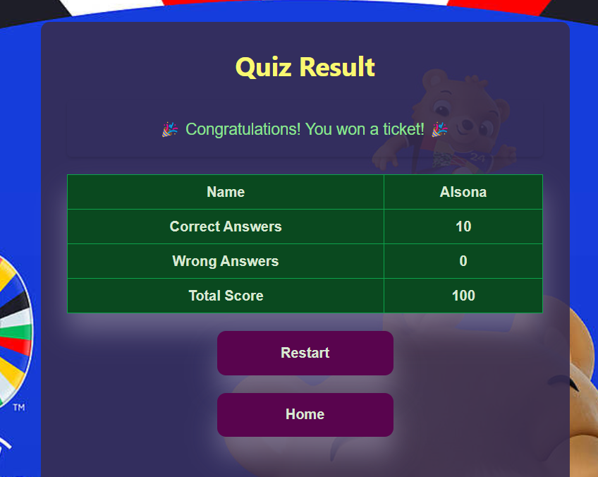

  - Two more buttons will appear like restart and home.

  - After clicking the restart button, the game will be restarted with a random turn of questions. 
  - If the user click on home button, it will take him to the landing page. 
  
- Sound Effects
  - The correct & incorrect sound effects are activated upon selecting an answer, helping to add excitement to the user's experience.

### Future Implementations

- A multi-player feature for participants to compete remotely head-to-head on different devices along with the possibility for them to challenge participants to these head-to-head games.
- I would like to create different levels of difficulty for the game.
- I would like to add a ranking scoreboard, that will display the usernames from top scored to less.

 ## Testing
- I tested that this page works in different browsers: Crome, Firefox, Safari.
- I confirmed that this project is responsive, looks good and functions on all standard screen sizes using the devtools device toolbar.
  
### Validator Testing

- **[HTML Validator](https://validator.w3.org/)**

  - No errors were returned when passing through the official W3C validator.

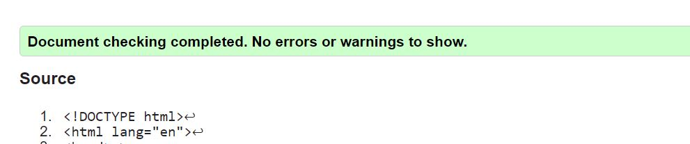 

- **[CSS Validator](https://jigsaw.w3.org/css-validator/)**
  - No errors were returned when passing through the official Jigsaw validator.

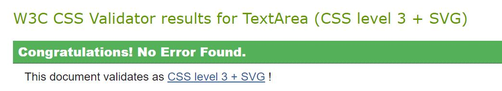
  
- **[JSHint](https://jshint.com/)**
  - No errors were returned when passing through the official jshint validator.

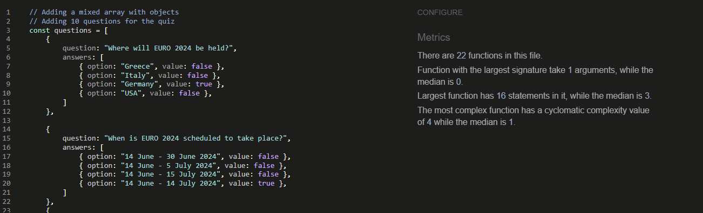

### Lighthouse
- Performance - How the page performs whilst loading.
- Accessibility - Is the site acccessible for all users and how can it be improved.
- Best Practices - Site conforms to industry best practices.
- SEO - Search engine optimisation. Is the site optimised for search engine result rankings.

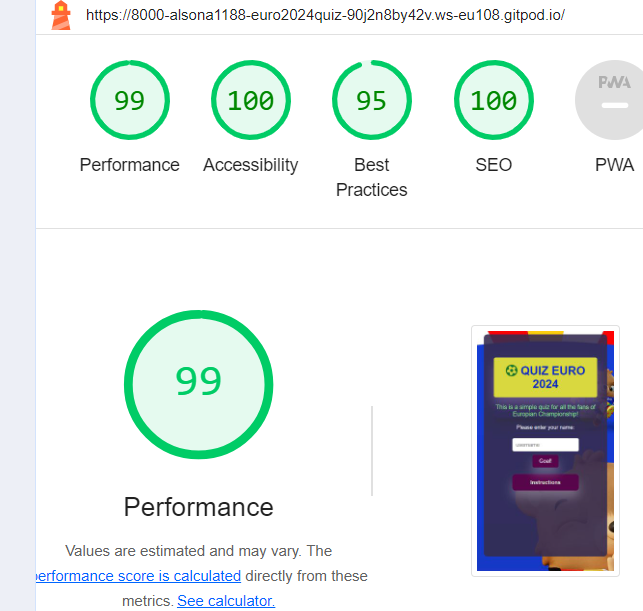 

### Bugs
 - Resolved Bugs:
 1. Experiencing the repeating of the questions after doing the random function. Resolved it by adding the code:
 let remainingQuestions = questions.filter(question => !askedQuestions.includes(question));
 2. When i pressed the restart button is showing the question 20 => resolved it by adding at the startGame()questionNo = 0.

 - Unresolved Bugs: There are no unresolved bugs.

 ## Technologies Used

- [HTML5](https://en.wikipedia.org/wiki/HTML5)
- [CSS3](https://en.wikipedia.org/wiki/Cascading_Style_Sheets)
- [JavaScript](https://en.wikipedia.org/wiki/JavaScript)
- [Google Fonts](https://fonts.google.com/) was used to import fonts into the style.css.
- [Font Awesome](https://fontawesome.com/) was used to add icons.
- [GitHub](https://github.com/) was used to save and store the files for the website.
- [Am I Responsive](https://ui.dev/amiresponsive) was used to display the website on different devices.
- [German website](https://www.dfb.de/en/news/detail/euro-2024-mascot-unveiled-252717/?no_cache=1&cHash=83982e31f16d14b0de8118a0ad7bc1ef) was used to search and load the background image.
- [Favicon.io](https://favicon.io/favicon-generator/) was used to create the favicon.
- [img2go](https://www.img2go.com/resize-image) was used to create the favicon.

 ## Deployment And Local Development

### Deployment to GitHub pages

The site is deployed using GitHub Pages. To deploy using GitHub pages:

1. Open the project repository.
2. Click on "Settings" on the navigation bar under the repository title.
3. Click on "Pages" in the left-hand navigation panel.
4. Under "Source", choose which branch to deploy. This should be Main for newer repositories.
5. Choose which folder to deploy from, usually "/root".
6. Click "Save", then wait for it to be deployed. It can take some time for the page to be fully deployed.
7. Your URL will be displayed above "Source".

### Local Deployment

#### How to Fork

1. Copy the link to this repository.
2. Log in or sign up to your GitHub account and click on the **Fork** button on the top-right corner.
3. You should now have a copy included in your account.

#### How to Clone

1. Copy the link to this repository.
2. Log in or sign up to your GitHub account and click on the **Code** button.
3. You are given to option to clone using HTTPS or GitHub CLI and copy the link.

## Credits

### Content

- The information I got for my questions mostly came from [UEFA wikipedia](https://en.wikipedia.org/wiki/UEFA_Euro_2024)
- Some concepts and parts of code were taken from a [tutorial by 'GreatStack'](https://www.youtube.com/watch?v=PBcqGxrr9g8&t=770s)..

- [Stackoverflow](https://stackoverflow.com/questions/9419263/how-to-play-audio) and their ideas of how to implement audios.

### Media

- The sound media files were all taken from [pixabay](https://pixabay.com/sound-effects/search/sound/).
- [German website](https://www.dfb.de/en/news/detail/euro-2024-mascot-unveiled-252717/?no_cache=1&cHash=83982e31f16d14b0de8118a0ad7bc1ef) was used to take the background image.

## Acknowledgements

I would like to acknowledge the following people who have been a huge help for this project:

-  [Precious Ijege](https://www.linkedin.com/in/precious-ijege-908a00168/) - My Code Institute Mentor for his advices and expertise.

- The Slack community of Code Institute for their help and support.

Alsona Natsi 2024.

[Back to top](<#contents>)

  
